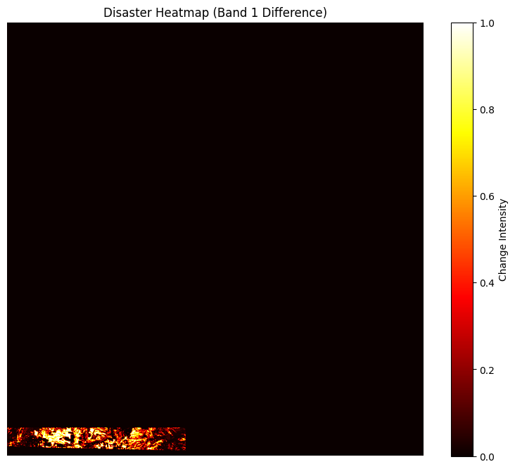

#  Global Disaster Prediction Using Satellite Imagery (2017–2025)

This project uses **Google Earth Engine (GEE)** to visualize and analyze disaster-prone areas globally using **Sentinel-2** satellite data from 2017 to 2025. The output includes yearly cloud-free mosaics and a global **disaster risk heatmap** based on spectral indicators of environmental stress (e.g., fires, floods, droughts, vegetation loss).

---

##  Objectives

- Generate cloud-free global composites using Sentinel-2 imagery.
- Analyze vegetation loss and land cover stress over time.
- Create a **disaster risk heatmap** to identify vulnerable areas.
- Export the results as `.tif` files for further GIS analysis.

---

##  Dataset Used

- **Sentinel-2 SR Harmonized**  
  `COPERNICUS/S2_SR_HARMONIZED`
- **Bands Used:** B2 (Blue), B3 (Green), B4 (Red), NDVI (derived)
- **Temporal Range:** 2017–2025
- **Spatial Resolution:** 10–100 meters

---

##  Methodology

1. **Cloud Masking**  
   QA60 band used to remove clouds and cirrus contamination.

2. **Index Calculation (NDVI)**  
   Vegetation stress and loss are detected using NDVI change.

3. **Disaster Hotspot Layer**  
   Areas with persistent low NDVI or NDVI decline are flagged.

4. **Export as GeoTIFF**  
   Heatmaps and yearly mosaics exported for visualization and research.

---

##  Screenshot



> *Sample disaster prediction heatmap showing high-risk zones due to vegetation loss and environmental stress.*

---

##  How to Use

1. Open the Google Earth Engine Code Editor: [https://code.earthengine.google.com](https://code.earthengine.google.com)
2. Paste the provided GEE JavaScript code.
3. Modify the year or region if needed.
4. Run the script to view the disaster heatmap.
5. Export results using `Export.image.toDrive()`.

---

##  Output

- `Disaster_Heatmap.tif`  
  A global heatmap showing areas of high disaster risk.

- `Sentinel2_Mosaic_<YEAR>.tif`  
  Yearly cloud-free true-color mosaic.

---

##  Example Code Summary

```javascript
// Define years, load Sentinel-2 SR images
// Apply cloud masking
// Calculate NDVI per year
// Detect stress zones
// Create heatmap image
// Export final TIF to Google Drive
 Applications
Forest fire risk analysis

Agricultural drought monitoring

Urban expansion impact on vegetation

Environmental stress prediction

 Folder Structure
bash
Copy
Edit
project/
│
├── disaster_heatmap.png         # Output screenshot
├── README.md                    # Project readme
└── gee_disaster_heatmap.js      # GEE code (JavaScript)
